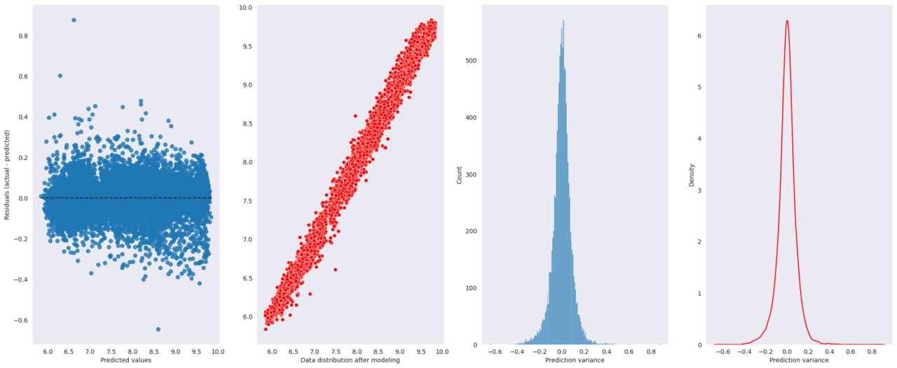
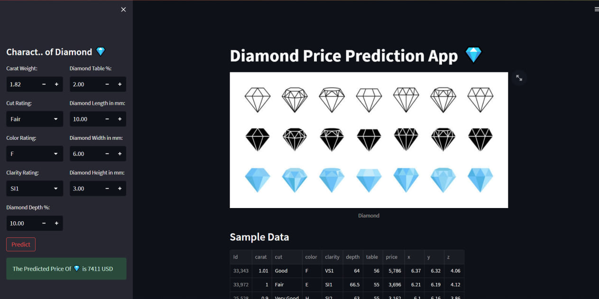
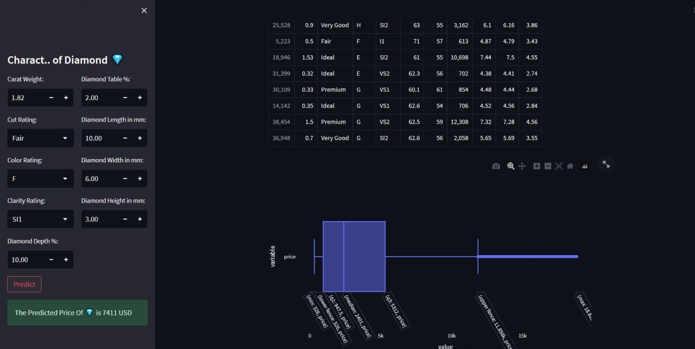
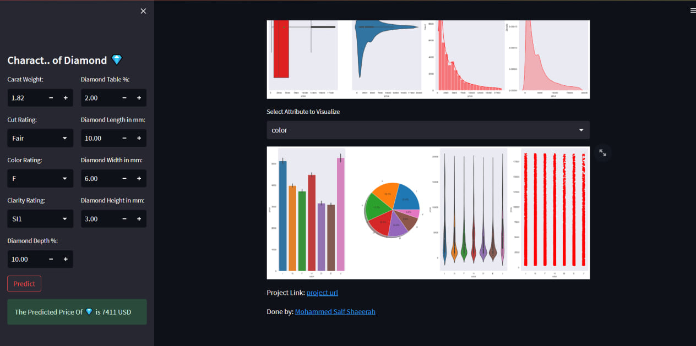

## **`An End-to-end-Diamond-Prediction 💎`**

## **`1- A Picture about diamond`**

## **`2- Some of EDA on data`**

## **`3- After Handling A Skewness Of Some Numerical Attributes`**

## **`4- Model Evaluation`**

This picture show the performance of Voting Regressor model after evaluated it on a new data

## **`5- Picture To Deployment Step`**
Here's a screnshot that show my streamlit app, and you can reach it by clicking on Open in streamlit:

1. 

2. 

3.

## **`6- A Video About How To Use The App`**

You Can See My Video About How To Use The Streamlit App By Clicking On 👇

[![LinkedIn Video]](https://www.linkedin.com/posts/mohammed-salf-shaeerah-650418258_machinelearning-algorithms-project-activity-7069680572125655040-Z6kX?utm_source=share&utm_medium=member_desktop)

