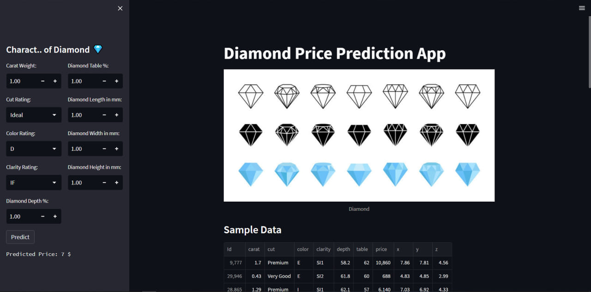

## **`End-to-end-Diamond-Prediction`**

## **`1- A Picture about diamond`**

## **`2- Some of EDA on data`**

## **`3- After Handling A Skewness Of Some Numerical Attributes`**

## **`4- Model Evaluation`**

This picture show the performance of Voting Regressor model after evaluated it on a new data

## **`5- Picture to Deployment step`**
Here's a screnshot that show my streamlit app, and you can reach it by clicking on this link:

